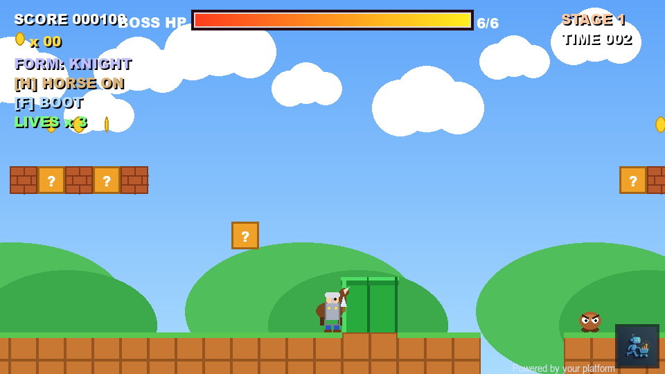

# 🍄 Fox Mario

<div dir="rtl">

لعبة منصّات ثنائية الأبعاد (2D platformer) بأسلوب سوبر ماريو، مكتوبة بـ **Python** و**pygame**. كل شيء — الرسوم، المؤثرات الصوتية، وموسيقى الـ chiptune — يُولَّد برمجياً بالكامل داخل الكود، فاللعبة لا تحتاج أي ملفات أصول خارجية.

## ✨ المميزات
- 🗺️ **مرحلتان:** كلاسيكية (عشب) + مرحلة بركانية عالية الخطورة 🌋
- 🍄 فطر تكبير/تصغير
- 👢 رمي أحذية على الأعداء
- 👹 **وحش نهائي** بـ HP bar وموسيقى معركة متغيّرة
- ⚔️ **سيف** يحوّل اللاعب إلى فارس 🛡️
- 🐎 الفارس يستدعي **حصانه** (يصهل ويجي من اليسار) ويسرع فيه
- 👸 إنقاذ الأميرة في النهاية — شاشة فوز
- 🎶 مؤثرات وموسيقى مولّدة بالكود (موجات square/triangle/sine) — بدون ملفات صوت

## ▶️ التشغيل

</div>

### Requirements
- Python 3.10+
- pygame

### Install & Run
```bash
pip install pygame
python super_mario.py
```
أو شغّل `run.bat` بنقرة مزدوجة على ويندوز.

### Controls
| Action | Keys |
|--------|------|
| Move | `←` `→` / `A` `D` |
| Jump | `Space` / `↑` / `W` |
| Throw boot | `F` / `X` |
| Summon horse | `H` |
| Restart | `R` |
| Quit | `Esc` |

## 📸 Screenshot


## 🧪 Testing
```bash
python test_game.py   # headless smoke test → "SMOKE TEST OK"
```

## 🛠️ Tech
- **Language:** Python 3
- **Engine:** pygame
- **Audio:** fully synthesized in code (waveform generation) — no asset files
- **Architecture:** tile-based levels · camera system · particle effects

## 📁 Project Structure
| File | Description |
|------|-------------|
| `super_mario.py` | Main game |
| `test_game.py` | Headless smoke test |
| `capture_shot.py` | Screenshot helper |
| `run.bat` | Windows launcher |
| `logo.png` | Game logo |
| `screenshot_game.png` | Gameplay preview |

---

## English

A classic-style 2D platformer inspired by Super Mario, written in **Python** with **pygame**. Graphics, sound effects, and chiptune music are all generated procedurally in code — the game ships with zero external asset files.

### Features
- 🗺️ Two stages: classic grassland + high-risk volcano 🌋
- 🍄 Grow/shrink mushroom
- 👢 Boot-throwing at enemies
- 👹 End boss with HP bar and dynamic battle music
- ⚔️ Sword pickup → knight transformation 🛡️
- 🐎 Summonable horse that charges through enemies
- 👸 Rescue-the-princess finale
- 🎶 100% code-synthesized audio (no sound files)

### Run
```bash
pip install pygame
python super_mario.py
```

### Controls
Move `← →`/`A D` · Jump `Space`/`↑`/`W` · Throw boot `F`/`X` · Summon horse `H` · Restart `R` · Quit `Esc`

Built with Python + pygame.
